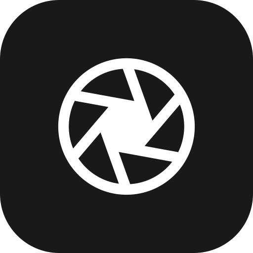
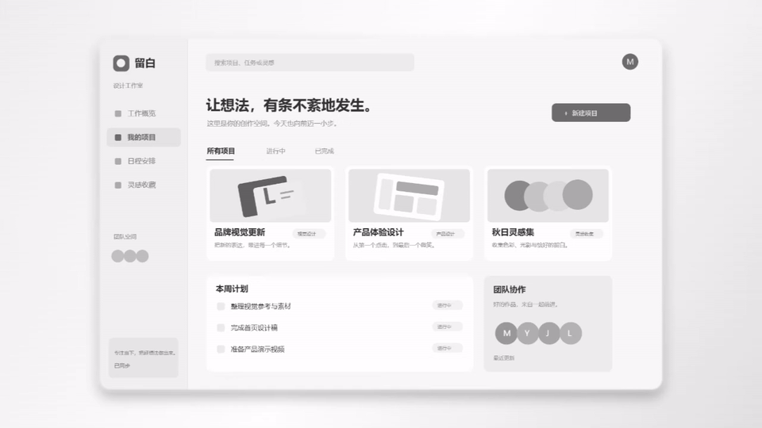
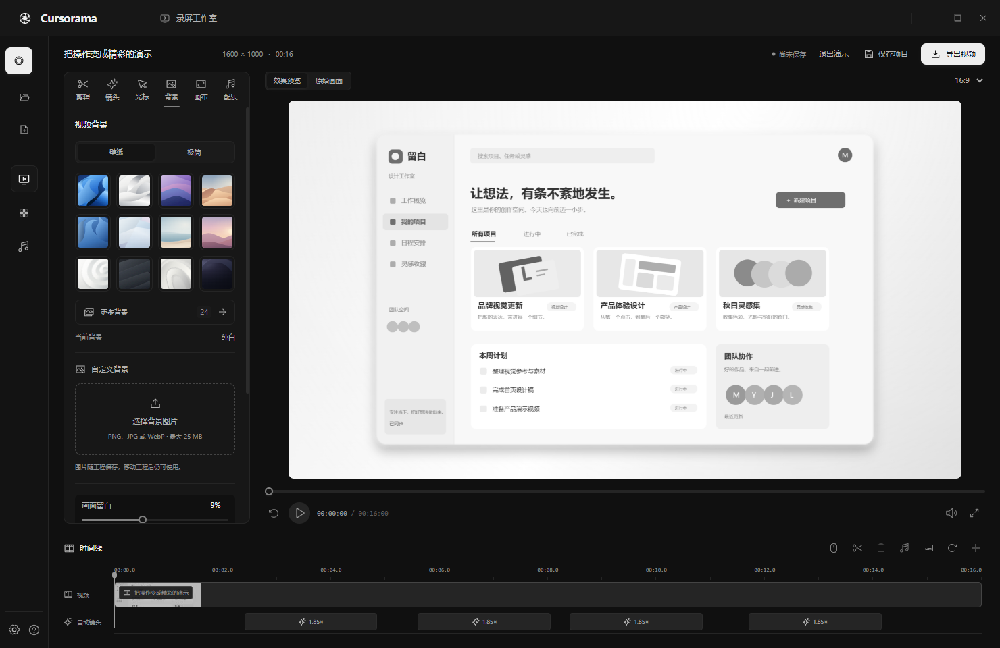
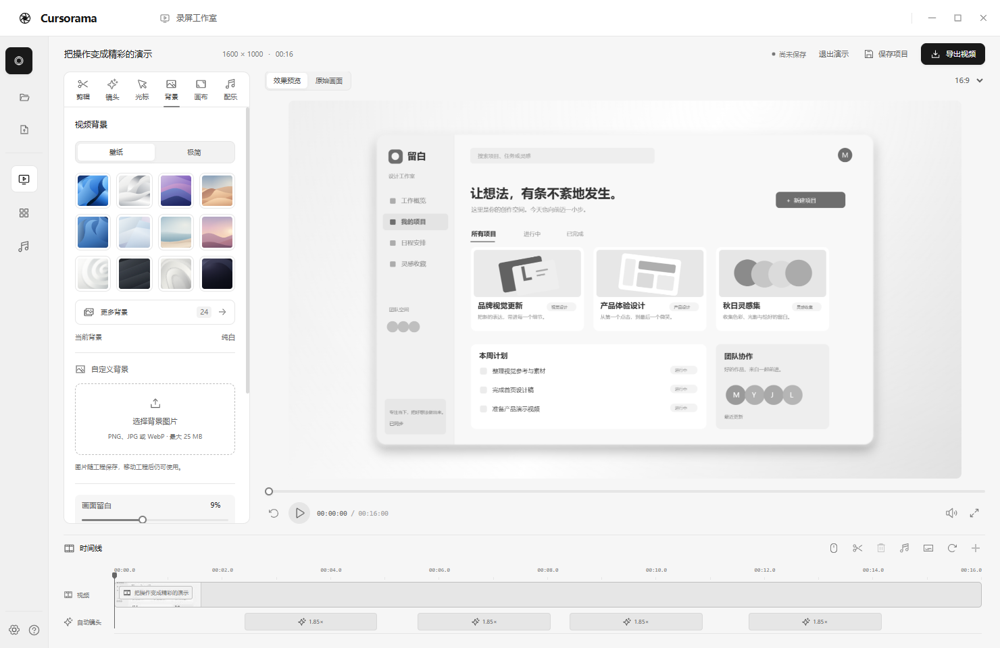

<div align="center">
  
  <h1>Cursorama</h1>
  <p><strong>光标即导演。</strong></p>
  <p>录下屏幕操作，让镜头自动跟上你的思路。</p>
  <p>
    
    
    <a href="LICENSE"></a>
  </p>
  <p>
    <a href="https://github.com/Mr-Q526/Cursorama/releases/latest">下载 Windows 版</a> ·
    <a href="#效果预览">效果预览</a> ·
    <a href="#快速开始">快速开始</a> ·
    <a href="docs/使用指南.md">使用指南</a> ·
    <a href="https://github.com/Mr-Q526/Cursorama/issues">反馈与建议</a>
  </p>
</div>

Cursorama 是一个面向产品演示、操作教程和功能讲解的开源录屏工具。名字由 **cursor**（光标）与 **panorama**（全景）组合而来：记录一次操作，根据鼠标移动和点击生成缩放、平移与三维透视，再把结果导出为演示视频。

## 效果预览



<div align="center">
  <sub>使用内置演示工程实际导出的 3 秒片段，循环展示自动运镜效果。</sub><br>
  <a href="docs/auto-camera.mp4">查看或下载 720p MP4 演示</a>
</div>

## 从录屏到成片

| 你负责演示 | Cursorama 负责画面 |
| --- | --- |
| 移动鼠标、点击重点 | 自动生成镜头，平滑跟随、缩放并限制取景边界 |
| 选择讲解方式 | 清晰聚焦、电影运镜、空间漫游、全景展示四种风格 |
| 调整镜头细节 | 独立编辑时间、倍率、焦点、透视和过渡 |
| 搭配视频外观 | 原创壁纸、黑白灰背景、留白、圆角、阴影和点击涟漪 |
| 录下画面与声音 | 先确认屏幕或窗口，默认 3 秒倒计时，可选麦克风与系统声音 |
| 随时继续编辑 | 本地自动保存，独立项目库管理工程与历次成片 |
| 导出给观众 | MP4 / WebM，最高 4K，30 / 60 fps，横屏、竖屏或方形 |

预览和导出共用渲染器。采集画面已包含系统鼠标时，保留真实鼠标，避免画面出现第二个光标。

## 黑白两种主题

<table>
  <tr>
    <th width="50%">深色 · 录屏工作室</th>
    <th width="50%">浅色 · 镜头编辑器</th>
  </tr>
  <tr>
    <td><a href="docs/preview-dark.png"></a></td>
    <td><a href="docs/preview-light.png"></a></td>
  </tr>
</table>

主题和存储位置统一放在左下角齿轮设置弹窗中。启动时进入空编辑器；左下角问号按钮可以打开独立运镜演示。

<details>
<summary>查看设置弹窗与本地项目库</summary>


</details>

## 给演示选一张壁纸


四款原创矢量壁纸参考 Windows / macOS 的视觉风格，支持背景模糊、压暗及 4K 输出。也可以选择黑白灰极简背景。**界面主题与成片背景分别设置。**

## 快速开始

从 [GitHub Releases](https://github.com/Mr-Q526/Cursorama/releases/latest) 下载 **Windows x64 压缩包**，完整解压到有写入权限的目录，运行其中的 `Cursorama.exe`。桌面运行环境和视频编码器已包含在压缩包中。

完整录制与跨应用鼠标追踪请使用 **Windows 桌面版**。也可以从源码运行，需要 Git、**Node.js 22.12 或更新版本**与 npm：

```powershell
git clone https://github.com/Mr-Q526/Cursorama.git
cd Cursorama
npm ci
npm run build
npm start
```

生成本地 Windows 程序：

```powershell
npm run package
```

运行生成的 `release/win-unpacked/Cursorama.exe`，或双击项目根目录的 `启动 Cursorama.cmd`。

仅预览浏览器编辑器：

```powershell
npm run dev
```

打开 [本地预览](http://127.0.0.1:5178)。开发服务支持本地项目库、手动镜头编辑和导出；完整的外部屏幕鼠标追踪在桌面版提供。

## 录一段自己的演示

1. **选来源**：点击「新建录制」，选择屏幕或应用窗口，确认实时预览。
2. **开始演示**：设置声音与倒计时，点击「开始录制」；默认等待 3 秒。
3. **整理镜头**：结束录制后，选择运镜风格，调整时间线、焦点和背景。
4. **导出成片**：选择格式、比例与清晰度，工程和视频会保存到本地。

录制中按 `Ctrl + Shift + F9` 结束，也可使用托盘菜单。编辑预览支持空格播放 / 暂停、左右方向键跳转。

默认工程目录为软件目录下的 `projects/`，成片目录为 `exports/`。在设置中可以分别修改位置，已有工程与历史成片仍能在项目库打开。详细操作见 [使用指南](docs/使用指南.md)。

## 开发与贡献

基于 **Electron · React · TypeScript · WebGL · FFmpeg**。录制、运镜、渲染与本地存储各自独立，固定界面文案按模块组织在 `src/i18n/`。

```powershell
npm test          # 单元测试
npm run build     # 类型检查与构建
npm run smoke     # Windows 桌面录制、恢复与导出集成验证
```

项目结构与验证说明见 [使用指南](docs/使用指南.md#开发与验证)，协作约定见 [AGENTS.md](AGENTS.md)。欢迎通过 [Issues](https://github.com/Mr-Q526/Cursorama/issues) 提交问题或建议，通过 Pull Request 贡献改进。

当前为早期版本，重点是屏幕录制、自动运镜与本地编辑导出。摄像头画中画、字幕、自动静音剪辑和云分享尚未提供；长视频处理仍需继续优化。

## 许可与致谢

自有源码采用 [MIT 许可证](LICENSE)。第三方组件许可见 [第三方组件说明](THIRD_PARTY_NOTICES.md)。项目受 [FocuSee](https://focusee.imobie.com/) 的演示录屏体验启发，为独立实现；仓库壁纸为原创素材。
