<div align="center">
  
  <h1>Cursorama</h1>
  <p><strong>光标即导演。</strong></p>
  <p>录下屏幕操作，让镜头自动跟上你的思路。</p>
  <p>
    
    
    <a href="LICENSE"></a>
  </p>
  <p>
    <a href="https://github.com/Mr-Q526/Cursorama/releases/latest">下载 Windows 版</a> ·
    <a href="#效果预览">效果预览</a> ·
    <a href="#快速开始">快速开始</a> ·
    <a href="docs/使用指南.md">使用指南</a> ·
    <a href="https://github.com/Mr-Q526/Cursorama/issues">反馈与建议</a>
  </p>
</div>

Cursorama 是一个面向产品演示、操作教程和功能讲解的开源录屏工具。名字由 **cursor**（光标）与 **panorama**（全景）组合而来：记录一次操作，根据点击、输入与持续操作生成缩放、平移与三维透视，再把结果导出为演示视频。

## 效果预览


<div align="center">
  <sub>使用内置演示工程实际导出的 3 秒片段，循环展示自动运镜效果。</sub><br>
  <a href="docs/auto-camera.mp4">查看或下载 720p MP4 演示</a>
</div>

## 从录屏到成片

| 你负责演示 | Cursorama 负责画面 |
| --- | --- |
| 点击重点、输入与滚动 | 短暂放大点击区域，持续操作保持聚焦，空闲后平滑回到全景 |
| 选择讲解方式 | 清晰聚焦、电影运镜、空间漫游、全景展示四种风格 |
| 调整镜头细节 | 独立编辑时间、倍率、风格、透视和过渡，焦点沿用录制时的操作区域 |
| 搭配视频外观 | 原创壁纸、黑白灰背景、留白、圆角、毛玻璃边缘、阴影和点击涟漪 |
| 录下画面与声音 | 先确认屏幕或窗口，默认 3 秒倒计时，可选麦克风与系统声音 |
| 随时继续编辑 | 本地自动保存，独立项目库管理工程与历次成片 |
| 整理演示节奏 | 分割、裁剪、删除视频片段，调整倍速并保留鼠标运镜 |
| 补充讲解内容 | 插入本地视频、原创配乐和字幕，素材一起保存到工程 |
| 点出操作重点 | 聚焦时叠加短音效，原声与背景配乐持续播放 |
| 精确定位细节 | 左右方向键逐帧移动，时间显示分、秒和帧 |
| 保持版本更新 | 启动后自动检查 GitHub Release，设置中手动检查、下载并安装 |
| 导出给观众 | MP4 / WebM，最高 4K，30 / 60 fps，横屏、竖屏或方形 |

预览和导出共用渲染器。采集画面已包含系统鼠标时，保留真实鼠标，避免画面出现第二个光标。

## 黑白两种主题

<table>
  <tr>
    <th width="50%">深色 · 工程编辑器</th>
    <th width="50%">浅色 · 工程编辑器</th>
  </tr>
  <tr>
    <td><a href="docs/preview-dark.png"></a></td>
    <td><a href="docs/preview-light.png"></a></td>
  </tr>
</table>

工程编辑器使用左侧参数面板、右侧大预览和底部通栏时间轴。视频与镜头轨道默认显示，鼠标轨迹按需展开，加入音乐和字幕后再显示对应轨道；背景直接提供 12 张缩略图。

启动时直接显示本地项目库，点击工程封面进入编辑器；点击成片进入独立预览，可以返回项目库或编辑关联工程。项目库顶部的「导入」菜单可导入工程文件或视频素材。左下角问号按钮可以打开独立运镜演示。

左下角齿轮打开设置弹窗，按「外观」「本地存储」「关于」分类展示。「关于」集中展示版本检查、更新日志、作者与开源仓库。切换分类保留目录草稿，底部操作固定可见。

桌面版顶部只保留品牌、页面路径和窗口控制。「新建录制」位于左侧，「导出视频」位于工程工具栏，设置与问号在左下角并排。拖动顶部空白区域移动窗口，双击最大化／还原；设置弹窗打开时也能操作窗口。

在「背景 → 毛玻璃边缘」中调整画面与背景交界的柔化强度，设为 0 可关闭。毛玻璃只作用于边缘，画面主体保持清晰，预览与导出一致。

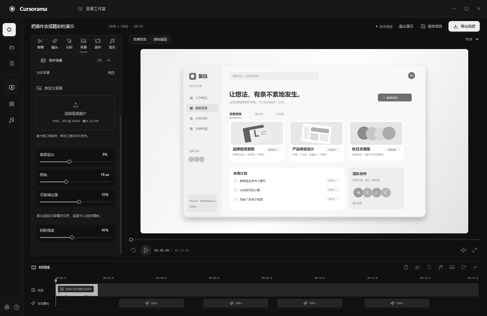

<details>
<summary>查看设置弹窗与本地项目库</summary>

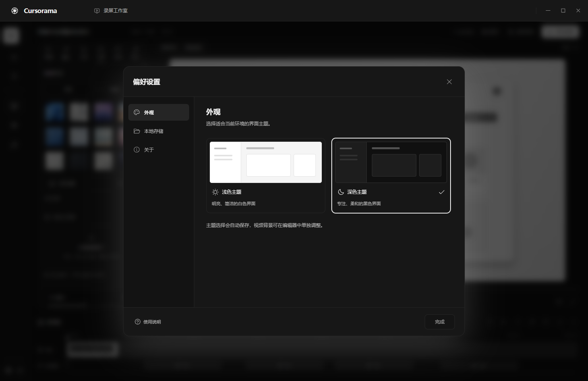

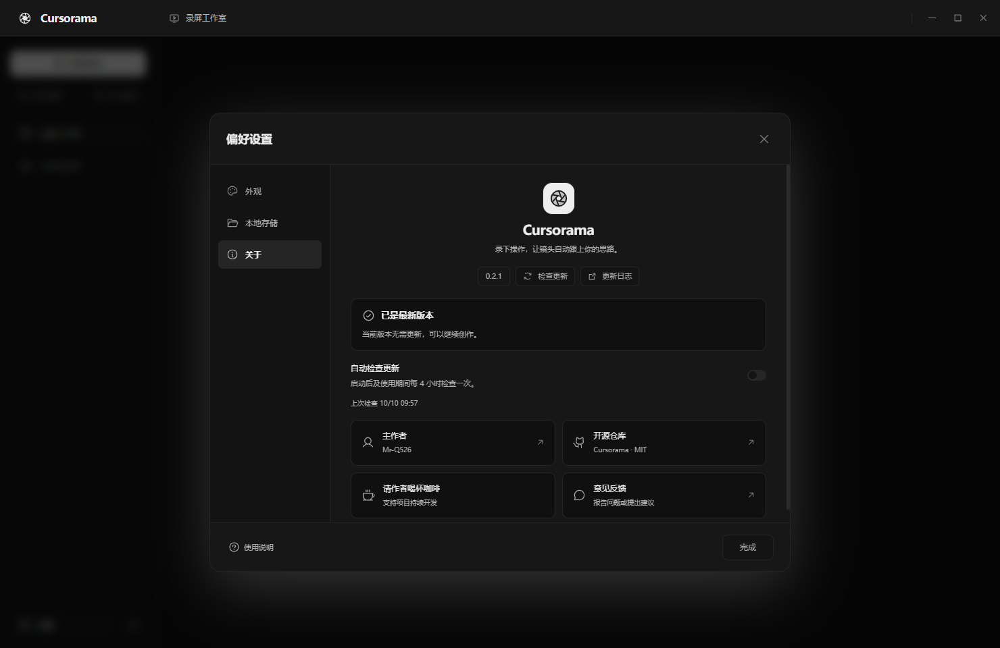

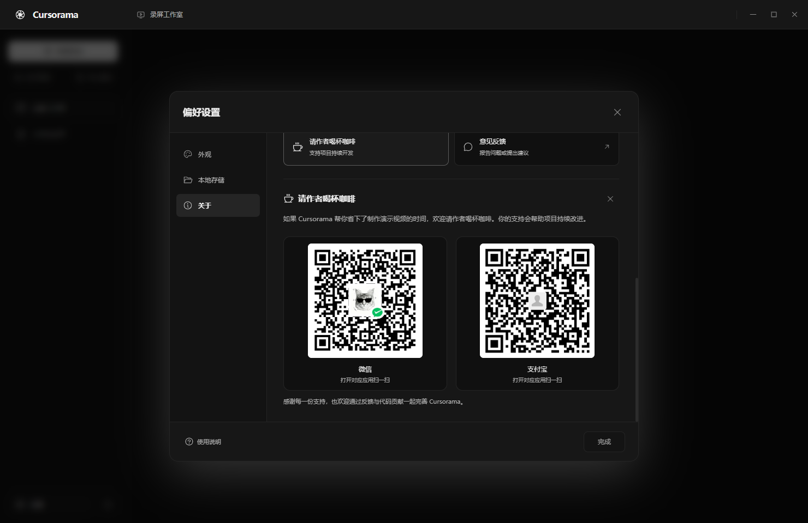


</details>

## 给演示选一张壁纸

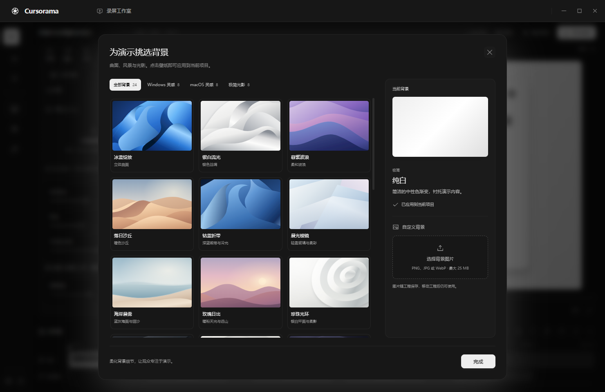

24 张原创矢量壁纸分为 Windows 灵感、macOS 灵感和极简光影。在「背景 → 更多背景」弹窗中查看大图，点击即可应用，支持模糊、压暗及 4K 输出。也可以选择黑白灰极简背景，或上传自己的图片；自定义图片随工程保存，预览和导出使用同一张背景。**界面主题与成片背景分别设置。**

## 给演示配上音乐

打开工程后，编辑器内的「配乐」标签提供 10 首由代码合成的原创器乐，涵盖轻钢琴、氛围、节奏、民谣、爵士、电影与复古风格，按风格浏览，试听后添加到当前播放位置。音乐随软件本地打包，无需联网；也可以导入自己的音频。默认以轻声音量衬托讲解，片段自动淡入淡出。添加后在时间轴选中音乐片段，调整开始时间、素材区间和音量，或删除片段。

曲库采用紧凑列表，支持搜索和风格筛选，每首直接试听或添加。时间轴的音乐片段显示真实音频波形与音量曲线，随素材裁剪和音量调整同步变化，首尾曲线对应实际淡入淡出；导入的本地音频也支持。

同一面板提供独立的「聚焦音效」：柔和轻点、空气轻扫、玻璃轻响和轻弹 4 款原创短音效，可试听、开关及调节音量。镜头进入聚焦时播放一次，连续输入期间不重复响；配乐继续播放。分割、裁剪、倍速或删除镜头后，音效同步调整。暂停和逐帧查看保持安静，预览与导出使用相同混音。

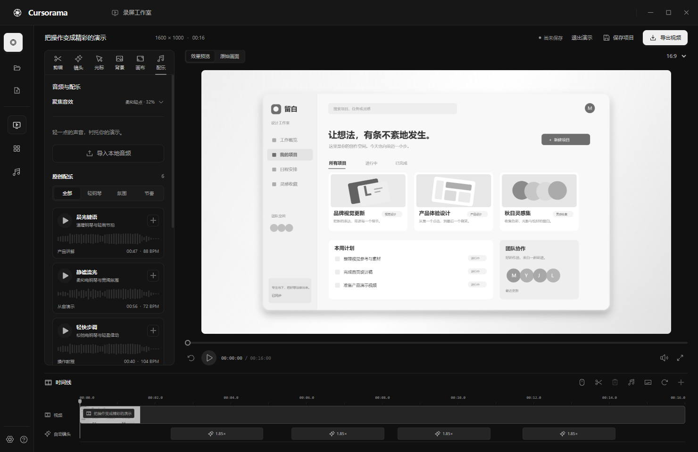

<details>
<summary>查看聚焦音效设置</summary>

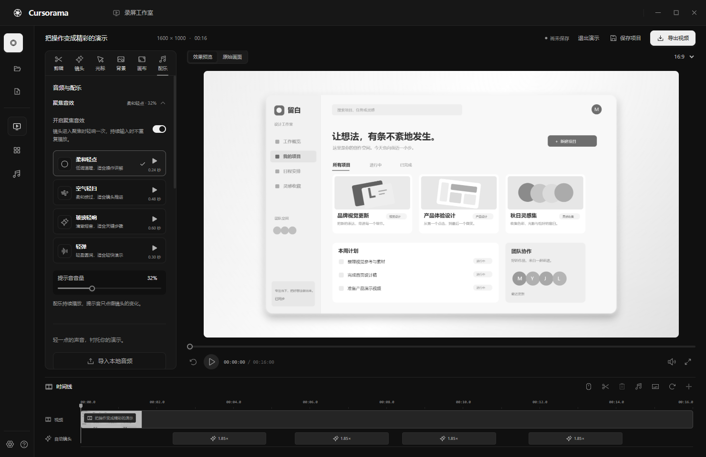

</details>

## 让演示更紧凑

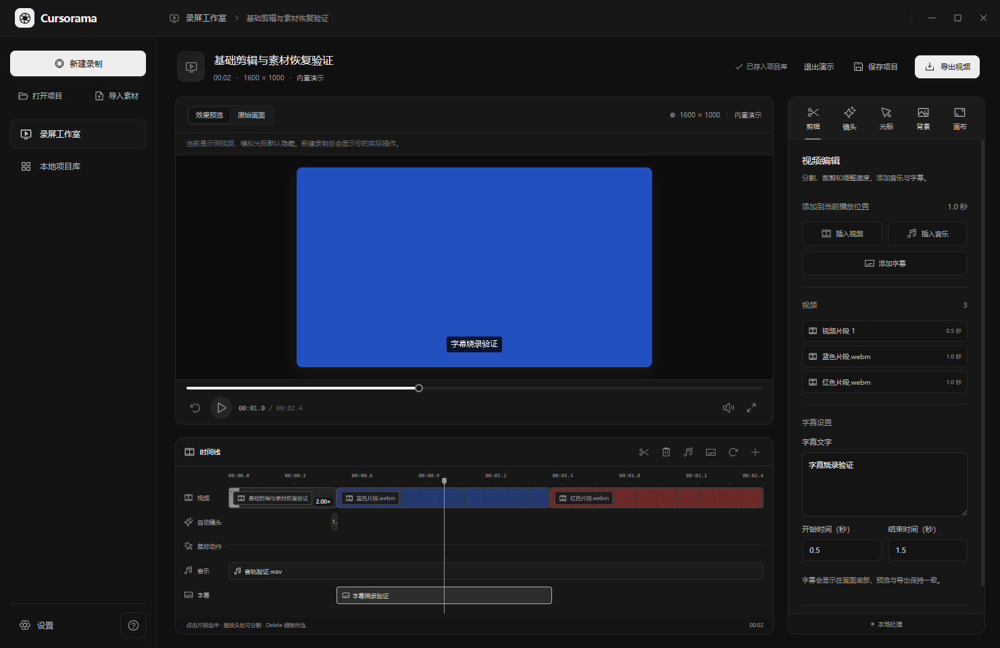

选中视频片段，在播放头分割、调整素材入点与出点，或者删除不需要的部分；播放速度支持 0.25× 到 4×。镜头效果独立保留，可以选中后删除。插入视频素材、背景音乐和字幕时使用当前播放位置，左侧「剪辑」面板提供时间、文字和音量设置。

字幕出现在画面底部并烧录到导出视频。工程包含原始录制和插入的媒体，移动或删除最初的素材文件后仍可继续编辑。本地项目库使用封面卡片展示工程和成片，便于找到不同演示。

## 让镜头跟上操作节奏

- **点击**：点击后平滑放大，保持约 1.6 秒，再用约 0.85 秒回到全景。连续点击合并，焦点平滑转到新的操作位置，移开的鼠标不会带走镜头。
- **输入**：桌面版读取输入控件或文字光标的位置，持续输入保持聚焦；小范围光标移动不晃动，超出舒适区后平移。宽输入框适当降低倍率，输入时减轻透视倾斜，结束后留出阅读时间再退出。
- **滚动与拖动**：操作延长镜头；普通鼠标移动不会触发或延长放大。

只保存活动时间与区域坐标，不保存按键、输入文字或密码。未暴露文字光标或输入控件的应用沿用最近操作焦点。旧工程点击「重新生成」可应用新的点击节奏；持续输入聚焦需要本版录制时采集的活动轨迹。

## 快速开始

从 [GitHub Releases](https://github.com/Mr-Q526/Cursorama/releases/latest) 下载 **Windows x64 Setup 安装包**，运行 `Cursorama-Setup-版本号-x64.exe`，选择安装目录后启动。桌面运行环境和视频编码器已包含在安装包中，安装和后续更新会保留工程、成片及保存位置设置。

**软件更新**：在「设置 → 关于」中手动检查、下载，下载完成后点击「重启并安装」。默认启动后自动检查，使用期间每 4 小时检查一次；可以关闭自动检查。安装前会保存当前工程，录制和导出期间不执行安装。旧版 `0.1.0` 需先手动安装本版，之后即可使用内置更新。

完整录制与跨应用鼠标追踪请使用 **Windows 桌面版**。也可以从源码运行，需要 Git、**Node.js 22.12 或更新版本**与 npm：

```powershell
git clone https://github.com/Mr-Q526/Cursorama.git
cd Cursorama
npm ci
npm run build
npm start
```

生成本地 Windows 程序：

```powershell
npm run package
```

运行生成的 `release/win-unpacked/Cursorama.exe`，或双击项目根目录的 `启动 Cursorama.cmd`。

仅预览浏览器编辑器：

```powershell
npm run dev
```

打开 [本地预览](http://127.0.0.1:5178)。开发服务支持本地项目库、手动镜头编辑和导出；完整的外部屏幕鼠标追踪在桌面版提供。

## 录一段自己的演示

1. **选来源**：启动后进入本地项目库，点击「新建录制」打开弹窗，选择屏幕或应用窗口，确认实时预览。
2. **开始演示**：设置声音与倒计时，可在「提词器」中粘贴讲解稿；默认等待 3 秒后开始录制。
3. **整理镜头**：通过悬浮小组件结束录制，工程自动保存并进入编辑器，调整运镜风格、时间线和背景。焦点根据录制时的点击和持续操作生成。
4. **导出成片**：选择格式、比例与清晰度，工程和视频会保存到本地。

取消新建录制会回到原页面。之后可以在本地项目库点击工程封面继续编辑，或点击成片独立预览。

录制开始后，桌面主窗口自动隐藏，屏幕上只留下可拖动的悬浮小组件：查看有效时长、暂停／继续、打开提词器、结束录制。暂停时间不进入成片。按 `Ctrl + Shift + F8` 暂停／继续，按 `Ctrl + Shift + F9` 结束，也可使用托盘菜单。

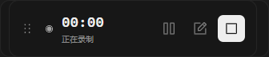

提词器支持自动滚动、速度、字号和镜像；暂停录制或收起提词器时停止滚动，讲解稿自动保存在本机。桌面悬浮控件和提词器设置了 Windows 屏幕采集排除。

<details>
<summary>查看提词器与全屏预览</summary>

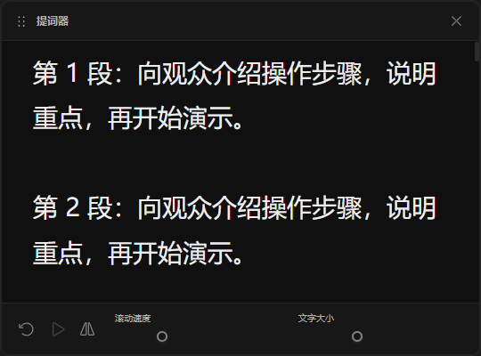

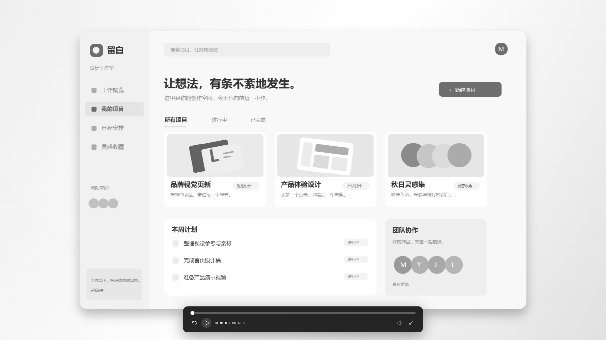

</details>

编辑预览支持空格播放／暂停，左右方向键暂停播放并逐帧移动；时间显示为「分:秒:帧」。新录制按采集帧率定位，旧工程与没有帧率信息的导入视频默认使用 30 帧时间轴。双击画面进入或退出全屏。全屏底部显示进度、播放／暂停、声音和退出按钮，播放时自动淡出，移动鼠标重新显示。圆角在预览和导出中一致，不会露出白色矩形边缘。

默认工程目录为软件目录下的 `projects/`，成片目录为 `exports/`。在设置中可以分别修改位置，已有工程与历史成片仍能在项目库打开。详细操作见 [使用指南](docs/使用指南.md)。

## 开发与贡献

基于 **Electron · React · TypeScript · WebGL · FFmpeg**。录制、运镜、渲染与本地存储各自独立，固定界面文案按模块组织在 `src/i18n/`。

```powershell
npm test          # 单元测试
npm run build     # 类型检查与构建
npm run smoke     # Windows 桌面录制、恢复与导出集成验证
npm run test:recording-controls # 主窗口隐藏、悬浮控件与提词器验证
npm run test:updates # 先生成安装包，再验证下载校验、窗口控制与安装触发
```

项目结构与验证说明见 [使用指南](docs/使用指南.md#开发与验证)，协作约定见 [AGENTS.md](AGENTS.md)。欢迎通过 [Issues](https://github.com/Mr-Q526/Cursorama/issues) 提交问题或建议，通过 Pull Request 贡献改进。

当前支持基础顺序剪辑、音乐与底部字幕。转场、多层画中画、字幕样式编辑、手动音频包络编辑、自动静音剪辑和云分享尚未提供；长视频处理仍需继续优化。

## 请作者喝杯咖啡

如果 Cursorama 帮你省下了制作演示视频的时间，欢迎请作者喝杯咖啡。你的支持会帮助项目持续改进。

<table>
  <tr>
    <th align="center">微信</th>
    <th align="center">支付宝</th>
  </tr>
  <tr>
    <td align="center"><a href="public/support/wechat.jpg"></a></td>
    <td align="center"><a href="public/support/alipay.jpg"></a></td>
  </tr>
</table>

打开对应应用扫一扫，或点击图片查看原图。软件内也可通过「设置 → 关于 → 请作者喝杯咖啡」查看二维码。

感谢每一份支持，也欢迎通过反馈与代码贡献一起完善 Cursorama。

## 许可与致谢

自有源码采用 [MIT 许可证](LICENSE)。第三方组件许可见 [第三方组件说明](THIRD_PARTY_NOTICES.md)。项目受 [FocuSee](https://focusee.imobie.com/) 的演示录屏体验启发，为独立实现；仓库壁纸、代码生成的配乐与聚焦音效为原创素材。
