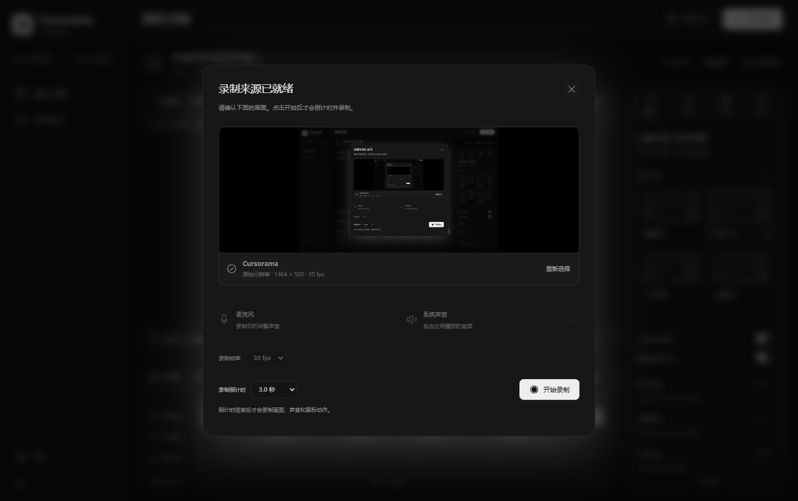
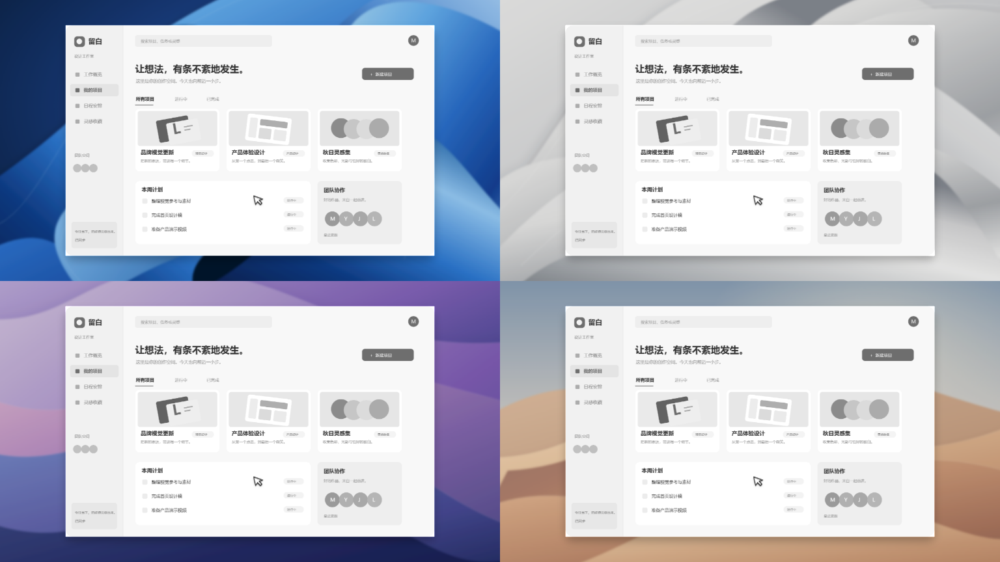
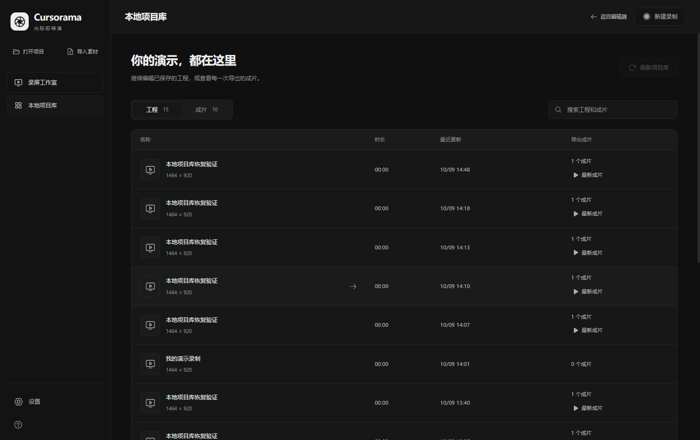
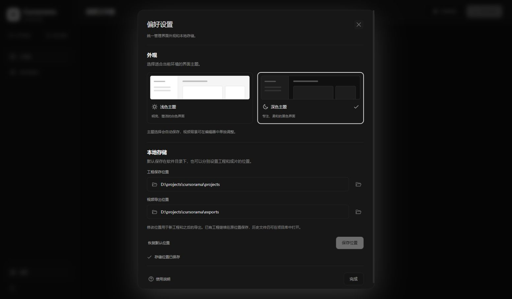

# Cursorama 使用指南

[返回项目首页](../README.md)

## 启动与录制

按照首页的源码运行步骤构建后，使用 `npm start` 启动桌面版。打包后可以直接运行 `release/win-unpacked/Cursorama.exe`，也可以双击根目录的 `启动 Cursorama.cmd`。

1. 点击「新建录制」，选择屏幕或应用窗口，按需开启麦克风和系统声音，点击「确认录制来源」。浏览器开发版使用「选择屏幕或窗口」打开系统选择器。
2. 检查实时预览、采集尺寸与帧率。录制使用来源的原始分辨率，码率随分辨率与帧率调整。
3. 选择倒计时：关闭、3 秒、5 秒或 10 秒，默认 3 秒。点击「开始录制」后，倒计时结束才开始记录视频、声音和鼠标动作。倒计时期间可点击取消或按 Esc。
4. 完成演示后，按 `Ctrl + Shift + F9` 或通过托盘菜单结束录制。视频进入编辑器，并自动保存到本地项目库。



启动时显示空编辑器。左下角问号按钮打开内置运镜演示，点击「退出演示」可返回空编辑器。

## 镜头与鼠标

在「镜头」面板选择清晰聚焦、电影运镜、空间漫游或全景展示。程序根据点击生成镜头，合并连续点击，平滑过渡并限制取景边界。时间线中的每个镜头都可以独立调整时间、倍率、风格、焦点和启用状态；点击预览画面可以重新设置焦点。

桌面版追踪 Windows 全局鼠标移动与左右键点击。录制窗口时，根据窗口位置换算鼠标坐标。采集画面已包含系统鼠标或无法确认时，保留真实鼠标并禁用额外光标绘制；仅在采集接口明确报告鼠标已隐藏时，根据轨迹重绘光标。点击涟漪与自动运镜仍可使用。此规则也适用于旧工程，避免出现第二个鼠标。

浏览器无法可靠取得外部屏幕的鼠标坐标，因此使用浏览器时可以录制和手动编辑镜头，完整自动运镜请使用桌面版。Windows 鼠标按钮约每 16 毫秒轮询一次，极短点击可能漏记。

编辑预览支持空格播放 / 暂停、左右方向键跳转。预览使用 WebGL 透视渲染，缓冲区至少 1080p，全屏及高分屏会重新计算，最高使用 4K 缓冲区；最终细节仍取决于原始素材。

## 背景与画布

右侧「背景」面板提供「壁纸」和「极简」两组选择：

| 风格 | 壁纸 | 画面特点 |
| --- | --- | --- |
| Windows 灵感 | 冰蓝绽放 | 蓝色立体曲面 |
| Windows 灵感 | 银白流光 | 黑白银色丝绸 |
| macOS 灵感 | 暮紫波浪 | 蓝紫粉色渐变 |
| macOS 灵感 | 落日沙丘 | 暖色山丘 |



壁纸为原创 SVG，随画布清晰缩放，支持 4K 输出。横屏、竖屏和方形画布按比例铺满并居中裁切。背景模糊、压暗、留白、圆角和阴影可以分别调整，设置随工程保存并用于导出。壁纸参考系统的视觉风格，没有使用 Windows 或 macOS 官方壁纸文件。

在左下角齿轮设置弹窗中切换浅色或深色主题，选择会自动保存在本地。界面主题只改变编辑器；成片背景在「背景」面板独立设置。

## 保存与项目库

默认使用软件所在目录：打包版为 `Cursorama.exe` 所在目录，源码开发版为项目目录。无需新建工作区。

```text
软件目录/
  .cursorama/
    storage.json
  projects/
    <工程 ID>/
      project.cursorama
  exports/
    <工程 ID>/
      <成片 ID>.mp4
      <成片 ID>.webm
```

工程文件包含原始视频、鼠标轨迹、镜头、裁剪区间和视觉设置，不依赖最初导入文件的位置。录制结束、导入视频和导入外部工程后自动保存；编辑修改会在短暂延迟后更新同一个工程，也可以手动点击「保存项目」。重复保存保留工程 ID，每次导出保留独立成片。

左侧「本地项目库」打开独立页面，可以搜索、恢复工程、播放最新成片和查看全部历史导出。点击成片后可使用本地播放器预览，或打开所在文件夹。进入项目库或打开设置弹窗会暂停预览并保留当前工程。



项目库直接扫描磁盘，重启后重新读取。文件被移走后会在刷新时更新，损坏工程会单独提示。保存和导出先写临时文件，再原子替换正式文件；失败的半成品不会显示在列表中。Windows 短暂锁文件时进行有限重试，库内读写按顺序执行。

## 修改存储位置

打开左下角齿轮设置弹窗，可以分别修改工程保存目录和视频导出目录，也可以恢复默认位置。桌面版支持系统目录选择器；浏览器开发版可输入完整路径。点击「保存位置」后，程序检查目录是否可写，并将设置保存到软件目录下的 `.cursorama/storage.json`。



修改工程位置用于之后的新工程，已有工程继续在原位置保存；修改导出位置对之后的导出生效。此前使用过的目录仍在项目库扫描范围内，历史工程和成片仍能打开，不会自动移动或删除文件。兼容旧版项目库及工程内部的 `exports` 目录。

启动前设置环境变量 `CURSORAMA_LIBRARY_DIR`，可指定另一默认存储根目录。

## 导出

导出会先保存当前工程，再将包含镜头与视觉效果的成片写入设置中的导出目录。支持 MP4 与 WebM，720p、1080p、1440p、2160p（4K），30 或 60 fps；默认输出分辨率随原始素材匹配。可以调整横屏、竖屏、方形或经典比例，以及裁剪导出区间。

预览与导出使用同一个渲染器。导出等待采集编码器启动后再计算视频时长，并在本地编码，短片不会把编码器启动耗时计入成片时长。录制和导出目前在内存中处理，超长视频尚未专门优化。

运行 `npm run dev` 的本地开发服务接入磁盘项目库，支持工程恢复及 MP4 / WebM 导出。单独托管静态网页时没有本机项目库服务，使用文件下载保存工程，仅提供 WebM 导出。

## 开发与验证

| 路径 | 内容 |
| --- | --- |
| `electron/` | 桌面入口、受限 IPC、录制来源、项目文件与 FFmpeg 编码 |
| `native/` | PowerShell 与 Win32 接口实现的 Windows 鼠标追踪 |
| `src/engine/` | 鼠标轨迹、镜头算法、透视渲染、录制和导出 |
| `src/components/` | 预览、时间线、检查器、项目库及对话框 |
| `src/i18n/` | 按模块拆分的固定界面文案 |
| `shared/` | 类型、配置、项目格式与校验 |
| `storage/` | 磁盘项目库、共享视频编码器与本地开发服务接口 |
| `src/library/` | 桌面 IPC 与浏览器存储客户端 |
| `public/wallpapers/` | 随程序打包的原创矢量壁纸 |
| `tests/` | 算法、项目恢复和桌面端集成验证 |

```powershell
npm test
npm run build
npm run smoke
npm run package
```

单元测试覆盖镜头算法、画面几何、录制与导出启动、项目恢复、背景设置、目录持久化、旧库兼容、并发读写、路径约束、文件锁重试与失败清理。

桌面集成验证只录制 Cursorama 自身窗口，检查来源选择、倒计时、真实鼠标追踪、实际录制、自动保存、工程恢复、成片播放、设置弹窗、主题、存储目录和壁纸，并解码检查音频与 4K 导出。报告与验证视频写入 `.qa/`，不提交到仓库。

打包先生成隔离的程序文件，再更新 `release/win-unpacked/`，保留软件目录下已有的工程、成片和存储配置。依赖、构建产物、本地配置及用户录制内容均被 `.gitignore` 排除。

协作规范见 [AGENTS.md](../AGENTS.md)，第三方许可见 [第三方组件说明](../THIRD_PARTY_NOTICES.md)。
